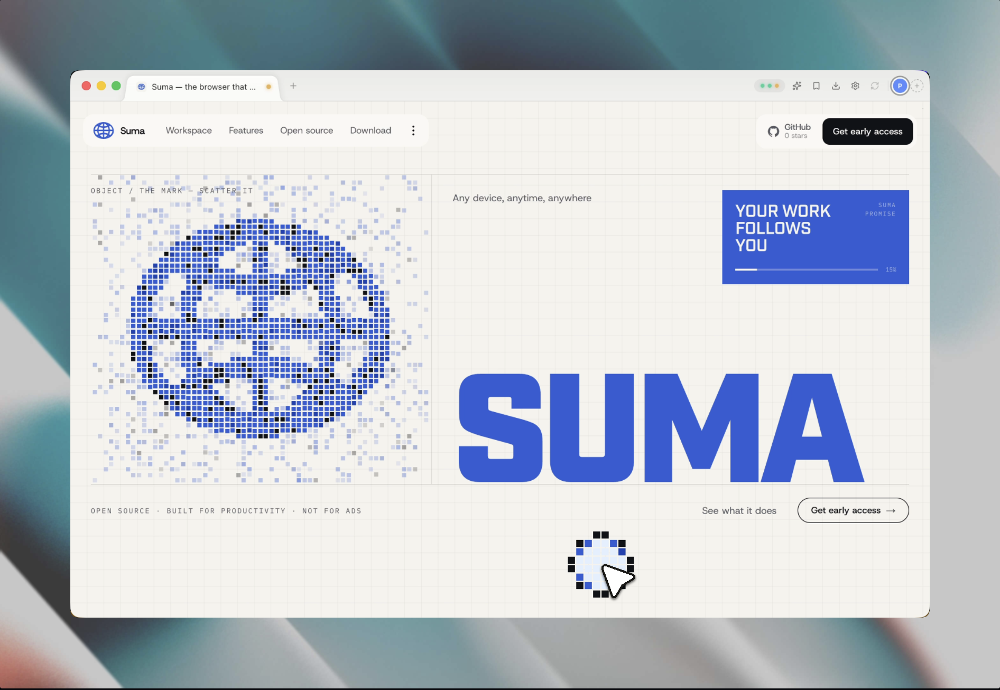

<h1 align="center">Suma</h1>

<p align="center">
  <strong>The browser that remembers where you left off.</strong>
</p>

<p align="center">
  <a href="https://sumabrowser.com">Site</a> ·
  <a href="docs/PRD.md">PRD</a> ·
  <a href="docs/security-model.md">Security model</a> ·
  <a href="docs/auth-flows.md">Auth flows</a> ·
  <a href="#architecture">Architecture</a> ·
  <a href="#getting-started">Getting started</a> ·
  <a href="LICENSE">AGPL-3.0</a>
</p>

<p align="center">
  <a href="LICENSE"></a>
  <a href="#getting-started"></a>
  <a href="https://sumabrowser.com"></a>
</p>

<p align="center">
  
</p>

<p align="center">
  <sub><em>Sign in once — your spaces, tabs, sessions and files follow you to any Mac you sit down at.</em></sub>
</p>

---

Suma is a desktop browser with cloud-native memory. Rendering stays local;
only **state** is cloud-native. Underneath your account is a personal cloud
machine — a real Linux computer that holds your files, runs your long jobs,
and keeps going after you close the lid. The VM is a state store and a
computer, never a renderer: nothing streams.

[Watch the demo](https://github.com/zmeyer44/suma/raw/main/docs/assets/suma-demo-overall.mp4)
— 90 seconds of spaces, continuity, and the terminal tab.

## What it does

- **Sign in once, signed in everywhere.** Sessions and the canonical
  workspace restore when a device is linked. Every site is labeled with what
  will actually happen — portable, assisted, or device-bound — and the label
  comes from a test run against the current release, not a promise.
- **Pick up where you left off.** Tabs, spaces, and your place in the app
  reconcile across devices through explicit Push / Pull / Merge — no silent
  clobbering.
- **A library, not a link pile.** Double-tap Shift and Suma saves the *item*
  on the page — the book, the product, the article — classified and described
  by a model, with page metadata as the fallback so a save always lands.
- **Videos that stay watchable.** Save a video from YouTube or X and it
  downloads locally with yt-dlp for offline viewing, uploads to your cloud
  files for every device, and plays in a floating window. Playback position
  syncs across devices.
- **Read aloud.** Select a passage and Suma reads it — with macOS system
  voices, or your own key for OpenAI or ElevenLabs. Keys never leave the main
  process.
- **Terminal + IDE in a tab.** A real terminal (100k lines of scrollback that
  survive cold boot), a file explorer, an editor, and forwarded ports into
  your cloud machine. Start an agent, close the laptop, check on it from
  anywhere.
- **Nostr, built in.** A NIP-07 `window.nostr` signer with the key encrypted
  at rest on your machine and per-site, per-method, per-event-kind
  permissions. Connect a [Buzz](https://github.com/block/buzz) workspace
  relay and your agent roster signs in with you over NIP-42.
- **Big files at datacenter speed.** Credential-free downloads over 50 MB are
  handed to the cloud machine; anything carrying a cookie, auth header, or
  client certificate stays on your Mac — fail closed, with the UI saying why.

## Architecture

Five planes. The full product spec lives in [`docs/PRD.md`](docs/PRD.md).

```
┌──────────────────────────── CLIENT (macOS) ─────────────────────────────┐
│ Suma.app (Electron, castLabs ECS build — Widevine/VMP for DRM media)    │
│  ├─ UI: React + Tailwind (spaces, command bar, saves, Files, terminal)  │
│  ├─ WebContentsView per-space `persist:` partitions                     │
│  └─ Session hooks: cookies 'changed', will-download, CDP DOMStorage     │
│ sumad (Rust sidecar, launchd)                                           │
│  ├─ Local CONNECT proxy → QUIC tunnel → identity egress gateway         │
│  ├─ QUIC client → agent (mux: PTY, ports, VFS, control)                 │
│  └─ Chunk cache (BLAKE3-addressed, LRU)                                 │
└───────┬──────────────────────┬──────────────────────┬───────────────────┘
        │ WSS (hibernatable)   │ QUIC (mTLS)          │ QUIC (mTLS)
┌───────▼──────────┐  ┌────────▼───────────┐  ┌───────▼───────────────────┐
│ SESSION PLANE    │  │ IDENTITY EGRESS    │  │ COMPUTE PLANE (per user)  │
│ CF Workers + DO  │  │ PLANE (per user)   │  │ Firecracker microVM       │
│ "SessionHub":    │  │ Blind CONNECT only │  │  ├─ suma-agent (scoped    │
│  sealed records, │  │ Static egress IP   │  │  │   machine credential)  │
│  HLC registry,   │  │ No user code, non- │  │  ├─ Ubuntu 24.04, $HOME,  │
│  origin leases,  │  │ programmable, own  │  │  │   docker, toolchains   │
│  device presence │  │ network identity   │  │  └─ separate egress ident │
└───────┬──────────┘  └────────────────────┘  └───────┬───────────────────┘
        │                                     ┌───────▼───────────────────┐
┌───────▼──────────┐                          │ DATA PLANE                │
│ CONTROL PLANE    │                          │ R2 object store (FastCDC  │
│ Hono + Drizzle   │                          │ + BLAKE3 chunks)          │
│ accounts/devices │                          └───────────────────────────┘
│ billing/lifecycle│
└──────────────────┘
```

## Repo layout

| Path                | What it is                                                                            |
| ------------------- | ------------------------------------------------------------------------------------- |
| `apps/desktop`      | Electron + React shell — capture/hydration, saves, videos, TTS, Nostr, terminal, IDE  |
| `apps/files`        | `suma://files` UI                                                                     |
| `apps/www`          | Marketing site — Next.js App Router, Tailwind v4                                      |
| `services/control`  | Control plane: Hono + Drizzle — accounts, devices, billing, lifecycle                 |
| `services/sessionhub` | CF Worker + SessionHub Durable Object — sealed records, optional session gateway    |
| `services/assistant` | External-channel gateway, private assistant runner, and authenticated remote browser |
| `services/egressgw` | Identity egress gateway (Rust, CONNECT-only)                                          |
| `agent/`            | suma-agent inside the VM (PTY, ports, VFS; scoped machine credential)                 |
| `sidecar/`          | sumad client daemon (local proxy, QUIC, chunk cache)                                  |
| `packages/protocol` | HLC, cookie identity tuple, key hierarchy, sealed records, wire messages              |
| `packages/agent-client` | Authenticated TypeScript client for the VM agent mux                              |
| `packages/assistant-core` | Channel-neutral assistant, browser-tool, and capability contracts             |
| `packages/sync-engine` | Cookie sync semantics: tombstones, causal ancestry, leases, fidelity harness       |
| `packages/chunking` | FastCDC + BLAKE3 content-defined chunking (pinned against the Rust chunker)           |
| `packages/egress-policy` | Per-space proxy routing policy                                                   |
| `packages/config`   | Shared constants + seed origin corpus                                                 |
| `infra/`            | Deployment topology docs                                                              |
| `docs/`             | PRD, security model, auth flows, continuity corpus, per-phase specs                   |

## Getting started

```sh
pnpm install
pnpm dev          # turbo dev across workspace packages
pnpm test         # TypeScript test suites
pnpm test:rust    # cargo test --workspace (agent, sidecar, egressgw)
pnpm test:all     # both stacks
pnpm build        # turbo run build
pnpm check-types  # typecheck everything
```

`pnpm dev` runs everything locally and needs **no cloud credentials**:

| Service                 | Port      | Notes                                                                    |
| ----------------------- | --------- | ------------------------------------------------------------------------ |
| `services/control`      | 8787      | dev runs default here (`SUMA_CONTROL_URL`); packaged builds use `https://api.sumabrowser.com` |
| `services/sessionhub`   | 8788      | `wrangler dev`; point the desktop at it with `SUMA_HUB_URL`              |
| `services/assistant`    | 8790      | local health stub; external channels require explicit production credentials |
| `apps/desktop` renderer | 5173/5174 | whichever port Vite finds free (`ELECTRON_RENDERER_URL`)                 |
| `apps/files`            | 5173/5174 |                                                                          |
| `apps/www`              | 3000      | marketing site                                                           |

The control plane's dev entry substitutes the two backing services you won't
have locally: `DATABASE_URL=pglite` (embedded Postgres, same engine the tests
use) and `OBJECT_STORE=stub` (in-memory chunk store). Both warn on boot; real
credentials take precedence. The production entry refuses to boot without
them. One caveat to "no cloud credentials": if a repo-root `.env` exists, the
control dev server adopts its `FLY_*` keys and will provision **real** Fly
machines (`services/control/src/dev-env.ts`).

To preview the exact production experience from a dev checkout — hosted
control plane, discovered hub/gateway, vended AI, packaged-equivalent Files
bundle — use `pnpm --filter @suma/desktop dev:cloud` (details in
`docs/deployment.md`; agent-facing rules in `AGENTS.md`).

End-to-end suites drive two real Electron instances against a local
SessionHub: `pnpm test:e2e:gateway`.

## Design principles

The long-form versions live in [`docs/security-model.md`](docs/security-model.md)
and the [PRD](docs/PRD.md); these are the load-bearing ones:

- **Fail closed, say why.** If the egress gateway is unreachable, Suma blocks
  rather than silently leaking your real IP — with a one-click, self-resetting
  "browse direct for now". Authenticated downloads never leave your Mac, and
  the UI explains the refusal.
- **Honest labels over broad promises.** Session continuity is tested per
  release against the apps people actually use; anything untested or
  sensitive is labeled, and banks stay out of sync until you opt in.
- **Credentials never widen their audience.** The Nostr key, TTS provider
  keys, and site credentials live in the main process or the enclave —
  renderers and web pages see derived values only. Suma does not ship your
  cookies into a VM you can root.
- **No existence oracles.** File chunks are content-addressed per user, not
  globally — a shared store would let a chunk hash prove someone else has a
  file.
- **State what isn't done.** `~/cloud` is canonical in R2; `$HOME` is a
  snapshotted volume; neither is end-to-end encrypted in V1, and the Files
  app says so instead of implying otherwise.

## Status

Suma is in private beta (macOS 14+, Apple Silicon). Phases 1–3 of the PRD —
passkey/device-key auth with offline recovery, real-transport continuity,
identity egress, terminal + compute with process-aware suspend, and
chunk-deduplicated cloud files with quota — are implemented and tested; see
[`docs/`](docs/) for the per-phase specs and the deployment runbook.

## Contributing

Issues and pull requests are welcome. `pnpm test:all` and `pnpm lint:rust`
must pass; the docs hold themselves to stating what the code actually does,
and PRs are reviewed against that standard.

## License

[GNU AGPL-3.0](LICENSE). If you run a modified version as a network service,
the AGPL requires you to offer its source to the people who use it.
